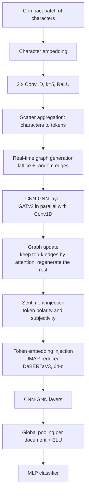

# QuickCharNet V2

**An efficient hybrid CNN–GNN model for text representation, with linear time and memory complexity in text length.**

[](https://arxiv.org/abs/2507.07414)
[](https://doi.org/10.5281/zenodo.15857891)
[](LICENSE)


This repository contains the official implementation of **QuickCharNet V2**, the model introduced in the paper
[*GNN-CNN: An Efficient Hybrid Model of Convolutional and Graph Neural Networks for Text Representation*](https://arxiv.org/abs/2507.07414) (Fardin Rastakhiz, 2025).
It is the successor to [QuickCharNet](https://github.com/FardinRastakhiz/QuickCharNet), extending its efficient character-level design from URL classification to general natural-language text of any length.

---

## Highlights

- **No padding, no truncation.** Documents in a batch are concatenated into a single *compact batch* of characters, so the model handles short titles and long reviews alike.
- **Real-time graph generation.** Each token becomes a node; lattice edges widen the local receptive field and random (small-world) edges carry document-level context. Random edges are resampled on every iteration to reduce overfitting.
- **Hybrid CNN–GNN layers.** A GATv2 (or sparse-attention) branch and a 1D-convolution branch run in parallel, combining global and local information.
- **Attention-guided graph updates.** After the first CNN–GNN layer, the most important edges are kept according to attention weights and the rest are regenerated.
- **Cheap knowledge injection from LLMs.** UMAP-reduced DeBERTaV3 token embeddings and token-level sentiment (polarity/subjectivity) are injected through dictionary lookups, with no LLM at inference time.
- **O(n) time and memory** with respect to input length, about **1.3 M parameters** and **~40 M FLOPs** per document.

## Architecture



### Generated graphs

The generator keeps graphs sparse as documents grow while preserving short paths and high clustering:

| Tokens in document | Density | Diameter | Avg. clustering | Avg. shortest path |
|---:|---:|---:|---:|---:|
| 360   | 0.0551 | 4 | 0.463 | 2.55 |
| 1,018 | 0.0196 | 4 | 0.450 | 2.94 |
| 1,709 | 0.0117 | 5 | 0.447 | 3.17 |

*(lattice start distance 2, lattice step 2, 8 lattice edges and 4 random edges per node)*

## Results

### Efficiency (AG-News)

| Model | Hidden dim | FLOPs (M) | Parameters (M) |
|---|---:|---:|---:|
| BERT (pretrained) | 512 | 43,536 | 109 |
| DistilBERT (pretrained) | 512 | 21,769 | 67 |
| Bi-GRU | 256 | 60 | 33 |
| **QuickCharNet V2** | **64** | **40** | **1.3** |

### Accuracy

| Dataset | Task | BERT | DistilBERT | Bi-GRU | **QuickCharNet V2** |
|---|---|---:|---:|---:|---:|
| AG-News | Topic classification (4 classes) | 94.49 | 94.79 | 91.53 | **93.08** |
| IMDB | Sentiment | 92.08 | 91.83 | 87.50 | **90.62** |
| RT-2K (Movie Review) | Sentiment, 10-fold CV | 89.50 | 90.00 | 77.85 | **87.13** |
| Yelp Polarity (40% subset) | Sentiment | 95.86 | 95.89 | – | **95.61** |
| Amazon Reviews (10% subset) | Sentiment | 94.26 | 94.28 | – | **94.37** |

BERT and DistilBERT are pretrained and fine-tuned; QuickCharNet V2 is trained from scratch. See the paper for precision, recall, F1, and the full ablation study.

## Installation

The code was tested with **Python 3.11.9** and **CUDA 12.6**.

```bash
git clone https://github.com/FardinRastakhiz/CNN-GNN-TEXT.git
cd CNN-GNN-TEXT

python -m venv .venv
source .venv/bin/activate        # Windows: .venv\Scripts\activate

pip install -r requirements.txt

# PyG extensions (must match the installed torch/CUDA build)
pip install pyg_lib torch_scatter torch_sparse torch_cluster torch_spline_conv \
    -f https://data.pyg.org/whl/torch-2.6.0+cu126.html

# spaCy model used for tokenization/embeddings
python -m spacy download en_core_web_lg
```

For a different CUDA version, change the `cu126` suffixes in `requirements.txt` and in the PyG wheel URL.

## Quick Start

### 1. Prepare token metadata

Run the notebooks in `codes/notebooks/0_Preparation/` to build the lookup tables the model injects:

| Notebook | Output |
|---|---|
| `token_embeddings_debertav3.ipynb` | UMAP-reduced (64/128-d) DeBERTaV3 token embeddings |
| `token_embeddings_gpt.ipynb` | UMAP-reduced OpenAI (tiktoken) token embeddings |
| `token_embeddings_spacy.ipynb` | UMAP-reduced spaCy token embeddings |
| `token_sentiment_debertav3.ipynb` | Token polarity and subjectivity scores (requires an OpenAI API key) |

The classification notebooks expect these files:

```
Data/ReducedEmbeddings/
├── deberta_larg_reduced_embeddings_64.npy
├── polarity_debertav3_tokens_gpt_mini_emb.npy
└── term_frequencies.pkl        # token frequencies used for sub-sampling
```

### 2. Download a dataset

Place the dataset CSVs under `data/TextClassification/<Dataset>/`, for example:

```
data/TextClassification/AGNews/
├── train.csv
└── test.csv
```

> **Note:** the notebooks currently use Windows-style paths (`Data\ReducedEmbeddings\...`). On Linux or macOS, replace the backslashes with `/` and check the capitalization of `Data`/`data`.

### 3. Train and evaluate

Open the notebook for your task and run it top to bottom:

```
codes/notebooks/2_CompareWithClassificationModels/
├── Categorization/AGNews/ag_news_classification_proposed_model.ipynb
└── SentimentClassification/
    ├── IMDB/imdb_classification_proposed_model.ipynb
    ├── MRRT2K/text_classification_test_2_movie_review.ipynb
    ├── Yelp/text_classification_test_1_yelp_subset.ipynb
    └── AmazonReview/text_classification_test_1_amazoin_review.ipynb
```

The core of each notebook looks like this:

```python
embedding_model = CGNetEmbedding(
    embedding_dim=64, hidden_dim=64, dropout=0.2,
    random_edges=6, lattice_edges=10,
    lattice_step=2, lattice_start_distance=2,
)
classifier = CNN_for_Text_No_Positional_Encoding(
    embedding_model, hidden_dim=64, dropout=0.2,
    num_out_features=num_classes,
)
```

## Default Hyperparameters

| Parameter | Value |
|---|---|
| UTF-8 character set size | 12,288 |
| Batch size | 224 / 256 / 512 |
| Hidden dimension | 64 |
| Injected embedding dimension | 64 |
| Lattice step size | 2 |
| Lattice edges per node | 10 |
| Random edges per node | 6 |
| Epochs | 70 |
| Dropout | 0.2 |
| Weight decay | 1.1e-5 |
| Initial learning rate | 0.0032 |
| Optimizer | AdamW |
| LR scheduler | MultiStepLR, milestones [15, 20, 30, 38, 40, 45, 50], gamma 0.5 |
| Loss | Binary / categorical cross-entropy |

## Repository Structure

```
CNN-GNN-TEXT/
├── codes/
│   ├── notebooks/
│   │   ├── 0_Preparation/                     # token embeddings, sentiment, frequencies
│   │   ├── 1_FindBestModel/                   # ablation study
│   │   │   ├── 0_Normalization/
│   │   │   ├── 1_DepthwiseCNN/
│   │   │   ├── 2_InjectTokenSemanticEmbeddings/
│   │   │   ├── 3_TokenSentimentInjection/
│   │   │   ├── 4_WhereToAddPositionalEmbedding/
│   │   │   ├── 5_LayersAttributionOnOutput/   # Captum attributions (HTML outputs)
│   │   │   └── 6_ReduceAttentionToStopWords/  # token sub-sampling
│   │   └── 2_CompareWithClassificationModels/ # QuickCharNet V2 vs. BERT, DistilBERT, Bi-GRU, Naive Bayes
│   └── scripts/                               # refactored modules (work in progress)
│       ├── Datasets/                          # datasets, data managers, tokenizers
│       ├── Models/layers/                     # GraphGenerator, GCNN
│       └── utilities/managers/                # Lightning models and training managers
├── utilities/                                 # layers and helpers imported by the notebooks
│   ├── model_layers/                          # GenGraph, GCNN, SentimentInjection, ModifiedGATv2Conv
│   ├── lightning_models/
│   ├── data_manager/
│   └── callbacks/
├── DataManipulation/                          # earlier data-preparation notebooks
├── FindBestModel/, Tasks/                     # earlier working copies of the experiment notebooks
├── requirements.txt
└── LICENSE
```

## Ablation Summary (RT-2K)

| Component | Finding |
|---|---|
| Normalization | Per-feature normalization across all tokens gave the best accuracy (82.61%). |
| Convolution type | Standard Conv1D beat depth-wise separable Conv1D (81.96% vs. 76.38%), despite ~3x more FLOPs. |
| Token embedding injection | DeBERTaV3 (64-d) performed best (84.04%); spaCy was the fastest. |
| Sentiment injection | Convolutional injection at two positions performed best (86.71%). |
| Stop-word sub-sampling | No clear gain (90.90% without vs. 90.89% with). |

## Roadmap

- Pretraining / transfer learning to close the gap on small datasets
- Knowledge distillation from a larger teacher
- Named entity recognition and text-embedding tasks for retrieval
- Cleaning up the codebase into an installable package

## Citation

If you use this code or model, please cite:

```bibtex
@misc{rastakhiz2025gnncnn,
  title         = {GNN-CNN: An Efficient Hybrid Model of Convolutional and Graph Neural Networks for Text Representation},
  author        = {Rastakhiz, Fardin},
  year          = {2025},
  eprint        = {2507.07414},
  archivePrefix = {arXiv},
  primaryClass  = {cs.CL},
  url           = {https://arxiv.org/abs/2507.07414}
}
```

## Related Work

- [QuickCharNet](https://github.com/FardinRastakhiz/QuickCharNet): the first version, an efficient character-level CNN for URL classification.
- [Beyond Words](https://github.com/FardinRastakhiz/Beyond-Words-Simplified): heterogeneous graph representations of text with GNNs.

## License

This project is licensed under the **GNU General Public License v3.0**. See [LICENSE](LICENSE) for details.

## Contact

Fardin Rastakhiz: fardin.rastakhiz@gmail.com
